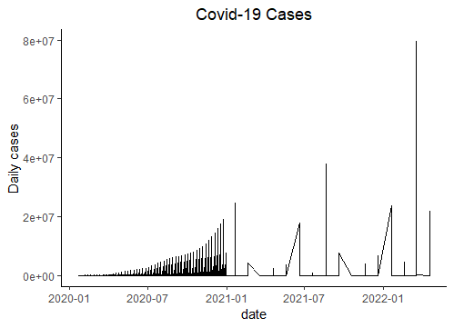
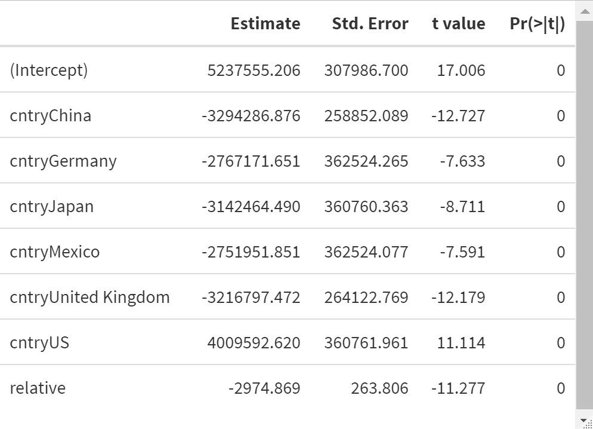

# Analytical notebook- Change in time-Covid

## Description of the Project

Based on daily report of Covid cases based on data from John Hopkins university.
https://github.com/CSSEGISandData/COVID-19

This study provides an analytical notebook which let user go through all the steps of the data analysis: visual and exploration of causal relationship.

## Repository organization

The results below are based on just one R script which can be found in the script folder. The figures can be found in the fig folder. The data is downloaded directly from the John Hopkins GitHub repository. At the end of the document you can see the info about the R session that produced these results.

## Main findings

## Causal relationship

## Session info
R version 4.2.0 (2022-04-22 ucrt)
Platform: x86_64-w64-mingw32/x64 (64-bit)
Running under: Windows 10 x64 (build 19044)

Matrix products: default

locale:
[1] LC_COLLATE=English_United States.utf8 
[2] LC_CTYPE=C                            
[3] LC_MONETARY=English_United States.utf8
[4] LC_NUMERIC=C                          
[5] LC_TIME=English_United States.utf8    

attached base packages:
[1] stats     graphics  grDevices utils     datasets  methods  
[7] base     

other attached packages:
 [1] gmodels_2.18.1      readxl_1.4.0        modelsummary_0.10.0
 [4] kableExtra_1.3.4    papeR_1.0-5         xtable_1.8-4       
 [7] car_3.0-13          carData_3.0-5       caret_6.0-92       
[10] lattice_0.20-45     RColorBrewer_1.1-3  haven_2.5.0        
[13] pastecs_1.3.21      stringr_1.4.0       purrr_0.3.4        
[16] tibble_3.1.6        ggplot2_3.3.5       tidyverse_1.3.1    
[19] forcats_0.5.1       jtools_2.2.0        tidyr_1.2.0        
[22] dplyr_1.0.8         readr_2.1.2         lubridate_1.8.0    

loaded via a namespace (and not attached):
  [1] colorspace_2.0-3     ellipsis_0.3.2       class_7.3-20        
  [4] fs_1.5.2             rstudioapi_0.13      farver_2.1.0        
  [7] listenv_0.8.0        bit64_4.0.5          prodlim_2019.11.13  
 [10] fansi_1.0.3          xml2_1.3.3           codetools_0.2-18    
 [13] splines_4.2.0        knitr_1.39           jsonlite_1.8.0      
 [16] pROC_1.18.0          broom_0.8.0          dbplyr_2.1.1        
 [19] compiler_4.2.0       httr_1.4.2           backports_1.4.1     
 [22] assertthat_0.2.1     Matrix_1.4-1         fastmap_1.1.0       
 [25] cli_3.3.0            htmltools_0.5.2      tools_4.2.0         
 [28] gtable_0.3.0         glue_1.6.2           reshape2_1.4.4      
 [31] tables_0.9.6         Rcpp_1.0.8.3         jquerylib_0.1.4     
 [34] cellranger_1.1.0     vctrs_0.4.1          gdata_2.18.0        
 [37] svglite_2.1.0        nlme_3.1-157         iterators_1.0.14    
 [40] timeDate_3043.102    gower_1.0.0          xfun_0.30           
 [43] globals_0.14.0       rvest_1.0.2          lifecycle_1.0.1     
 [46] gtools_3.9.2         future_1.25.0        MASS_7.3-56         
 [49] scales_1.2.0         ipred_0.9-12         vroom_1.5.7         
 [52] hms_1.1.1            parallel_4.2.0       yaml_2.3.5          
 [55] curl_4.3.2           pander_0.6.5         sass_0.4.1          
 [58] rpart_4.1.16         stringi_1.7.6        highr_0.9           
 [61] foreach_1.5.2        checkmate_2.1.0      hardhat_0.2.0       
 [64] boot_1.3-28          lava_1.6.10          systemfonts_1.0.4   
 [67] rlang_1.0.2          pkgconfig_2.0.3      evaluate_0.15       
 [70] labeling_0.4.2       recipes_0.2.0        bit_4.0.4           
 [73] tidyselect_1.1.2     parallelly_1.31.1    plyr_1.8.7          
 [76] magrittr_2.0.3       R6_2.5.1             generics_0.1.2      
 [79] DBI_1.1.2            pillar_1.7.0         withr_2.5.0         
 [82] survival_3.3-1       abind_1.4-5          nnet_7.3-17         
 [85] future.apply_1.9.0   modelr_0.1.8         crayon_1.5.1        
 [88] utf8_1.2.2           tzdb_0.3.0           rmarkdown_2.14      
 [91] grid_4.2.0           data.table_1.14.2    ModelMetrics_1.2.2.2
 [94] webshot_0.5.3        reprex_2.0.1         digest_0.6.29       
 [97] stats4_4.2.0         munsell_0.5.0        viridisLite_0.4.0   
[100] bslib_0.3.1  
